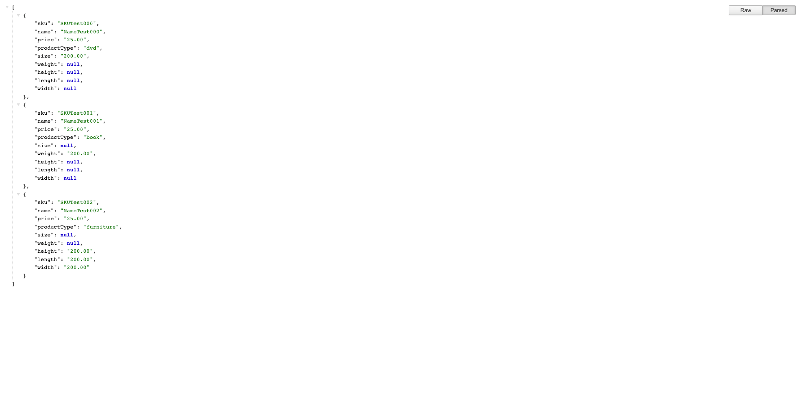
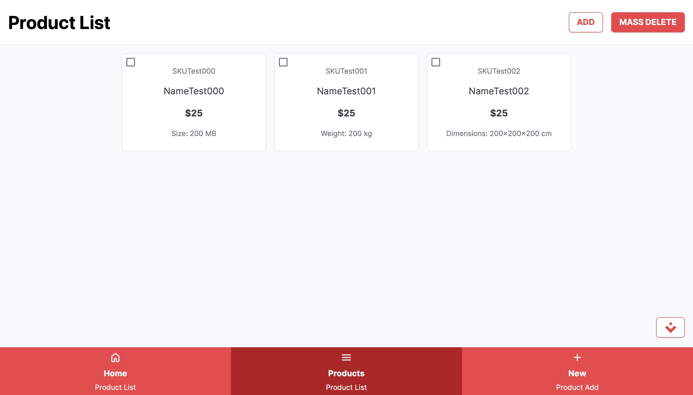

# Scandiweb Products

Mid-senior & Senior Web Developer test assignment in Scandiweb.

App demo: [produx.vercel.app](https://produx.vercel.app)

## 1. SWAPI - PHP REST API - [/api](api)
- [x] Vanilla PHP (without any framework)
- [x] Composer packages
- [x] OOP approach
- [x] PDO for SQL
- [x] MySQL database [import SQL from scandiweb.sql file](api/database/scandiweb.sql)
- [x] ENV config [set new .env based on .env.example](api/.env.example)
- [x] mod_rewrite [set in .htaccess correct ```RewriteBase /API_DIR```](api/.htaccess)

## 2. Produx - Nuxt.js client - [/client](client)
- [x] Nuxt v3
  - [x] Vue v3
  - [x] Vue Router
  - [x] Vue Meta
  - [x] TS
  - [x] Composition API with simple syntax & auto imports
  - [x] SPA / SSR / SSR + Hydration/ SSG as rendering options
  - [x] Vite and Nitro
- [x] Tailwind CSS v3
- [x] Storefront UI v2
- [x] PWA installable [check manifest.json](client/public/manifest.json)
- [x] ENV config [set new .env based on .env.example](client/.env.example)

## Ad.1 SWAPI screenshot
[](api/swapi-screenshot.png 'See SWAPI example screenshot')
## Ad.2 Produx screenshot
[](client/produx-screenshot.jpg 'See Produx example screenshot')
